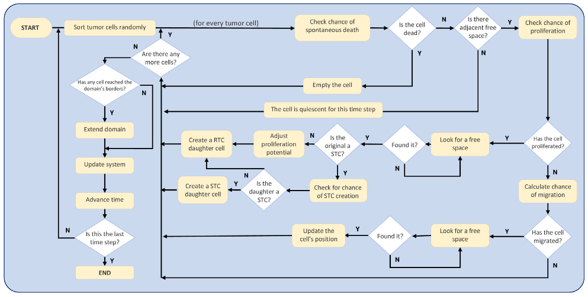

# educ-python-tumor

Projet de **simulation** de croissance tumorale en **Python**, dans le cadre du de l'UE **PLS2** de l'Université de Rennes. Le modèle est une version adapté de l'article ["Cellular-automaton model for tumor growth dynamics: Virtualization of different scenarios"](https://doi.org/10.1016/j.compbiomed.2022.106481) de Carlos A. Valentim, José A. Rabi et Sergio A. David (2023).

⚙️ numpy, matplotlib, seaborn, scipy

## Structure du projet

- `simulation_tumor.py` : module principal contenant les fonctions de simulation de la croissance tumorale et de visualisation des résultats.
- `scenario_X.py` : scripts de simulation pour différents scénarios (X = 1, 2, 3). Appellent les fonctions de `simulation_tumor.py` avec des paramètres spécifiques.
- `plots/` : dossier pour sauvegarder les graphiques générés.
- `img/` : dossier pour sauvegarder les images de la croissance tumorale à différents intervalles.

## Fonctionnement

Les cellules sont modélisées sur une grille 2D, où chaque cellule peut être de différents types (cellules saines, cellules cancéreuses classiques, cellules cancéreuses "stem-like", etc.). La dynamique de croissance tumorale est simulée en fonction de paramètres tels que la probabilité maximale de division cellulaire (`pmax`), la probabilité d'apoptose, et d'autres facteurs biologiques.

Le diagramme de flux suivant illustre le processus de simulation :

## Scénarios simulés
- **scenario_1.py** : 
    - Croissance tumorale originant d'une cellule cancéreuse classique (RTC). 
    - Impact de la probabilité maximale de division cellulaire (`pmax`) sur la dynamique de croissance tumorale. 
    - Suivi de la population tumorale totale en fonction du temps et sauvegarde des images de la croissance tumorale à intervalles réguliers.
- **scenario_2.py** : 
    - Croissance tumorale originant d'une cellule cancéreuse "stem-like" non clonogénique (ncSTC). 
    - Impact de la probabilité maximale de division cellulaire (`pmax`) sur la dynamique de croissance tumorale. 
    - Suivi de la population tumorale totale en fonction du temps et sauvegarde des images de la croissance tumorale à intervalles réguliers.
- **scenario_3.py** : 
    - Croissance tumorale originant d'une cellule cancéreuse réellement "stem-like" (tSTC). 
    - Impact de la probabilité maximale de division cellulaire (`pmax`) sur la dynamique de croissance tumorale. 
    - Suivi de la population tumorale RTC et tSTC + ncRTC en fonction du temps et sauvegarde des images de la croissance tumorale à intervalles réguliers.
- **scenario_4.py** : 
    - Croissance tumorale originant d'une cellule cancéreuse réellement "stem-like" (tSTC). 
    - Impact de la probabilité d'apoptose sur la dynamique de croissance tumorale.
    - Suivi de la population tumorale RTC et tSTC + ncRTC en fonction du temps et sauvegarde des images de la croissance tumorale à intervalles réguliers.